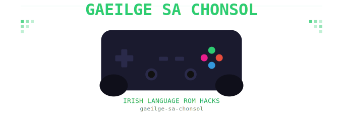

# Cluichi Gaeilge - Irish Language ROM Hacks

Irish language patches for retro games, created to normalise Irish in digital
spaces and meet language learners through games they have nostalgia for.

## Games

### PS1
- **Spyro the Dragon** (PAL, SCES-01438) - In progress

## Structure
ps1/
spyro/
spyro1/
scripts/   - Patching, mounting, WAD tools
data/      - Translation CSV and Python data structures
patches/   - Generated BPS patch files
notes/     - Technical documentation and offset discoveries

## Approach
- Text patches applied directly to BIN file using verified sector offset formula
- Fada characters encoded as two-byte sequences (Á=Aa, É=Ea, Í=Ia, Ó=Oa, Ú=Ua)
- All strings sourced from main executable SCES_014.38
- Distributable as BPS patch files (apply with Flips)

## Tools Required
- Python 3
- Flips (for BPS patch generation)
- DuckStation or similar PS1 emulator for testing
